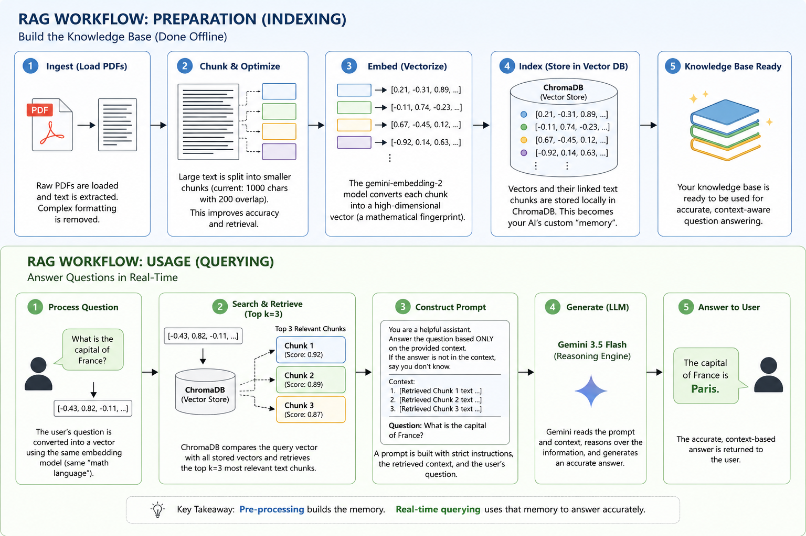
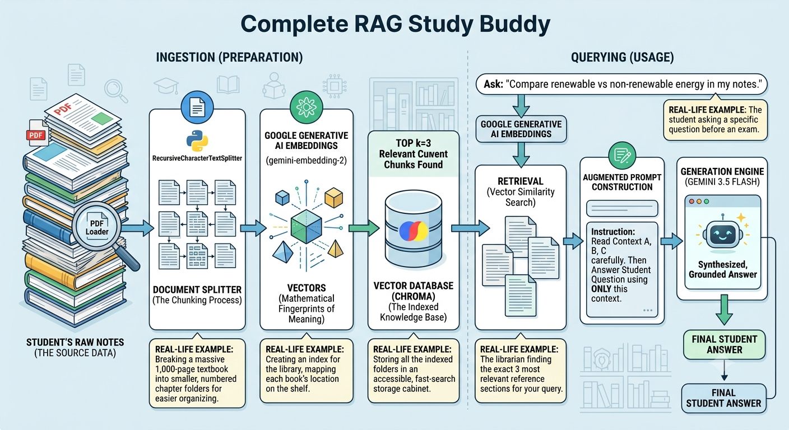

# RAG-AI-Study-Agent
# **RAG AI STUDY ASSISTANT**
This project is a lightweight, local implementation of Retrieval-Augmented Generation (RAG). This architecture is currently the industry standard for connecting powerful large language models (LLMs) to private, custom datasets while maintaining high accuracy.

By combining the modular LangChain framework, the localized memory of ChromaDB, and the advanced reasoning capabilities of the Gemini 3.5 Flash model, you are building an intelligent system. This system transforms static, overwhelming PDFs (like textbooks or complex study guides) into an active, conversational agent that can answer your specific questions with perfect factual grounding.

---


## **Why We Need It: The "Hallucination" and "Stateless" Problems**
Modern AI models like ChatGPT are incredibly powerful, but they suffer from two critical flaws that make them unreliable for study aids:

1. **The "Hallucination" Problem**
Analogy: Imagine asking a brilliant, highly creative librarian a hyper-specific question about the third clause on page 50 of your personal study notes. They will give you a beautiful, confident answer... but if they haven't read your notes, they will intuitively "fill in the blanks" with general knowledge that sounds plausible but is often factually incorrect (hallucination).

RAG Fix: RAG forces the AI to "consult the specific source text" before it tries to write an answer. It must prioritize retrieval over creation.

2. **The "Stateless" Problem**
LLMs are essentially stateless functions; they have "no memory" of previous user interactions or personal data. If you paste a 100-page PDF into a prompt, the model might crash, forget the beginning by the end, or lose focus.

RAG Fix: A local Vector Database (ChromaDB) acts as the AI's external "hard drive." The system only retrieves the three most relevant "chunks" required to answer the current question, ensuring the model never gets confused or overwhelmed.

---


## **Where We Can Use It (Real-Life Examples)**

| Sector | Documentation Type | Question Example (Use Case) |
| :--- | :--- | :--- |
| **Education** | *Physics Textbook PDF* | *"Based on chapter 5, what are the exact four factors that influence frictional force?"* (Study revision) |
| **Corporate** | *200-page HR Policy Manual* | *"What is the standard procedure for submitting a remote work request during Q3?"* (Onboarding assistance) |
| **Finance** | *Quarterly Earnings Report (10-Q)* | *"Summarize the three biggest operational risks cited in the forward-looking statements."* (Analysis/Synthesis) |
| **Healthcare** | *Niche Research Paper on AI* | *"Define 'Transformer Architecture' specifically as the authors use it in Section 3.1."* (Niche knowledge extraction) |

---

## **For Whom It's Important**

* **Students:** Demanding efficient, hallucinations-free revision tools that can handle specific curricula.
* **Researchers & Analysts:** Who must synthesize findings across multiple documents without missing critical details.
* **Developers:** Seeking a baseline, modern architecture for deploying private, compliant RAG agents locally.

---

## **Project Architecture**
- Main Folder 
  - data(folder) -- contains - notes.pdf
  - .env (for storing environment variables)
  - requirements.txt (for listing project dependencies)
  - ingest.py (for ingesting the PDF into the RAG system)
  - chat.py (for interacting with the RAG system)
  - readme.md file (for project documentation)
  - gemini api key from ai studio

---

# **Project Setup**
1. **Setting up the requirements.txt**
   - Create a new virtual environment.
   ```py
   python -m venv venv

   activate venv --> venv/scripts/activate
   ```
   - create a file 'requirements.txt' and write down the following dependencies:
   ```txt
   streamlit
   langchain
   langchain-google-genai
   langchain-community
   chromadb
   pypdf
   python-dotenv
   ```
   - Install the project dependencies using `pip install -r requirements.txt`.

2. **Getting API Key**
   - Create a new project in the ai-studio google platform
   - Create new api key
   - copy the api key
   - paste it in the .env file
   ```txt
   GEMINI_API_KEY=sk-xxxx
   ```

3. **Create two files of python extension**
   - ingest.py
   - chat.py


# **Tech Stack and Libraries : Deep dive and analogy**
We use a modern, modular stack to keep the system fast, flexible, and forwards-compatible.

### 1. Python (The Standard)
The standard ecosystem for AI development, offering unmatched library support for data handling and model integration.

### 2. Google Gemini Pro API (The Frontier Model)
We use `gemini-3.5-flash`.
* **Why specific:** This is Gemini's *performance-optimized* model. It offers extremely fast reasoning and generation capabilities, making it perfect for rapid-fire chat applications while remaining cost-effective.

### 3. ChromaDB (The Local Memory)
* **What it does:** Chroma is an open-source "embedding database" or "vector store."
* **Analog Real-Life Example:** Imagine a warehouse filled with millions of documents. **Standard Search** would be like typing 'apples' and getting every document that mentions 'apples.' **Vector Search (Chroma)** is like handing the database a description: *"Show me all papers discussing the health benefits of crisp, red fruit."* The database can return results on apples, pears, or even applesauce because it understands the *meaning,* not just the keyword.

### 4. python-dotenv (The Security Guard)
* **Why specific:** Essential for production-grade software security. It loads the `GEMINI_API_KEY` from a separate, local `.env` file that is *never* committed to Git. This prevents accidental exposure of your secret keys.
* **Used functions:** `load_dotenv()` (loads the key into memory).

### 5. LangChain (The Blueprint & Framework)
LangChain is not a library *of code*, but a framework for *orchestration.* It "chains" together disparate components (Loaders, Splitting, Embeddings, LLMs) into a stable workflow. In 2026, we use specific modular packages:

#### A. `langchain-community` (PDF Loading)
* **What it does:** Provides the tool that interacts with raw document formats.
* **Used functions:** `PyPDFLoader("data/notes.pdf")`
* **Why specific:** It handles the complex work of stripping a PDF's formatting and extracting clean, raw text from every page.

#### B. `langchain-text-splitters` (Optimization)
* **What it does:** Splits large text into usable "chunks."
* **Analog Real-Life Example:** You can't swallow a 200-page book in one gulp. **Chunking** is like chopping that book into small, bitesized paragraphs (e.g., 1000 characters). **Overlap** (200 characters) ensures that if a sentence is split, the context isn't lost (like having one sentence at the end of Chapter 1 and the same sentence starting Chapter 2).
* **Used function:** `RecursiveCharacterTextSplitter(chunk_size=1000, chunk_overlap=200)`

#### C. `langchain-google-genai` (The API Bridge)
* **What it does:** The official wrapper connecting LangChain components to Google's API services.
* **Why specific:** We must use this to ensure full compatibility with the specific capabilities of Gemini 3.5.

#### D. `langchain-chroma` (The Database Integration)
* **What it does:** Communicates with the local ChromaDB on your machine.
* **Why specific:** Essential wrapper for interacting safely with the vector storage without needing complex, low-level SQL database calls.

---


## 🧩 Code Explanation: `ingest.py` (The Preparation Phase)

This script is your application's "Knowledge Base Builder." It runs **once** to create the memory index.

| Real-World Step | Code Implementation | Deep Technical Analogy |
| :--- | :--- | :--- |
| **Config** | `load_dotenv()` | The system "turns on the security system," activating the hidden Gemini API Key. |
| **Load** | `PyPDFLoader("data/notes.pdf")` | The system "reads the raw document," extracting plain text while ignoring images and formatting. |
| **Optimize** | `RecursiveCharacterTextSplitter(...)` | The system "chops the data into bitesize chunks" (1000 characters). This preserves granularity for retrieval and keeps context consistent. |
| **Embed** | `GoogleGenerativeAIEmbeddings(model="models/gemini-embedding-2")` | **CRITICAL CONCEPT:** This initializes the specific model that translates *human language meaning* into a *mathematical map coordinate* (Vector). **Embeddings are the secret language of RAG.** |
| **Store** | `Chroma.from_documents(chunks, embeddings, "./chroma_db")` | **The Final Act:** The chunks, their linked vector maps, and metadata are written to your local external "hard drive" (`./chroma_db`). The index is created. |

---

## 💬 Code Explanation: `chat.py` (The Conversation Phase)

This script is your "Active Assistant Interface." It runs in real-time to answer your questions.

| Real-World Step | Code Implementation | Deep Technical Analogy |
| :--- | :--- | :--- |
| **1. Load DB** | `vectorstore = Chroma(./chroma_db, ...)` | Connects to the local, vector-mapped knowledge base prepared during Ingestion. |
| **2. Use Memory** | `embeddings = GoogleGenerativeAIEmbeddings(...)` | **CRITICAL CONSISTENCY:** The system uses the **EXACT SAME** model as `ingest.py`. *Analogy:* If you use an English-to-Math dictionary to *store* the memory, you must use the same dictionary to *search* it, or the search will fail. |
| **3. Init Brain** | `llm = ChatGoogleGenerativeAI(model="gemini-3.5-flash")` | Initializes the conversational "engine" (Gemini 3.5 Flash). `temperature=0.3` is intentionally low to prioritize factual recall over creative guesswork. |
| **4. Define Prompt** | `ChatPromptTemplate.from_template(...)` | Sets strict instructions for Gemini: *"You are a helpful study assistant. Answer ONLY from the provided context [context]. Do NOT hallucinate. If the answer isn't there, say you don't know."* |
| **5. Build Chain** | `create_stuff_documents_chain` and `create_retrieval_chain` | LangChain "orchestrates" the RAG workflow into one sequence: `vectorstore.as_retriever(k=3)` handles the similarity search, and the combined chain pipes the context and prompt to Gemini. |
| **6. Query (invoke)** | `retrieval_chain.invoke({"input": "..."})` | This single command triggers the full real-time RAG workflow: Vectorize Query -> Similarity Search in DB -> Context Assembly -> Prompt Construction -> LLM Inference -> Grounded Answer. |


## **Image explanation of Project**




